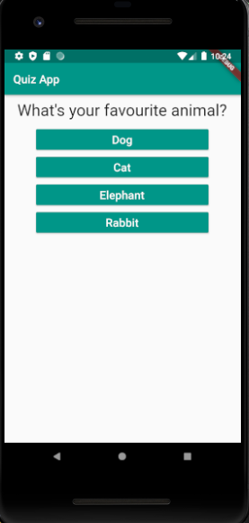
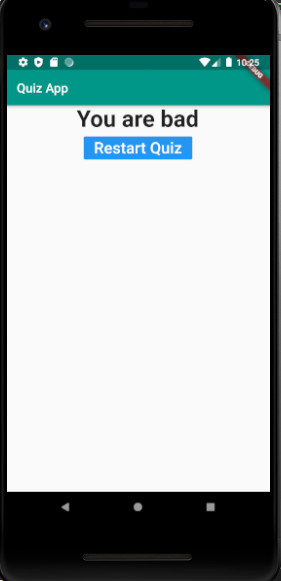

# Quiz App

A new Flutter project.
## ScreenShots

 

## Getting Started

This project is a starting point for a Flutter application.

## Goals for this sample

  * Simple and easy way to know flutter
  * Lists of primitive values
  * Maps containing primitive values

## Generating
To run this application go to run on top of vs code and press run without Debugging and make sure u already added your emulator from android studio.

